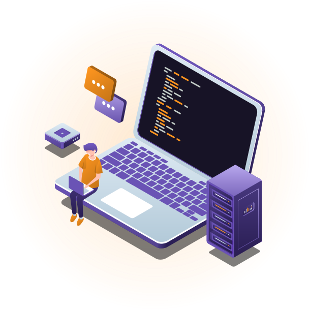
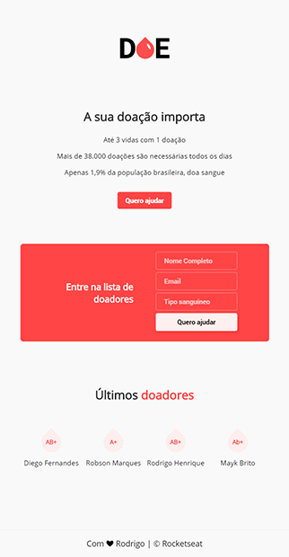

<p align="center">

</p>
<h1 align="center" >Maratona Dev 3</h1>
<p align="center">Projeto <strong>Doe</strong> desenvolvido durante a 3ª edição da Maratona Dev da <a href="https://rocketseat.com.br">Rocketseat</a> 🚀👩🏽‍🚀</p>

## 💻 Tecnologias

- [Node](https://nodejs.org/en/)
- [Nodemon](https://nodemon.io/)
- [PostgreSQL](https://www.postgresql.org/)
- [Nunjucks](https://mozilla.github.io/nunjucks/)

## 🤔 Sobre este Projeto

A ideia do projeto é: 

**"Incentivar, encontrar e registrar doadores de sangue".**

## Frontend

**obs: imagem com zoom out de 50%**

<p align="center">

</p>

## 🚀 Instalação

### Instalando
**Clone o Repositório**

```
git clone https://github.com/rodrigosuelli/maratonadev-3.git

cd maratonadev-3
```

**Instale as dependências com NPM ou Yarn**

```
npm install
//ou
yarn
```

**Rode `npm start` no terminal para iniciar o servidor (modo desenvolvimento), em seguida acesse a porta 3000 no navegador.**

## :memo: Licença
Este projeto está licenciado sob a licença [MIT](./LICENSE) &copy; [Rocketseat](https://rocketseat.com.br/).
